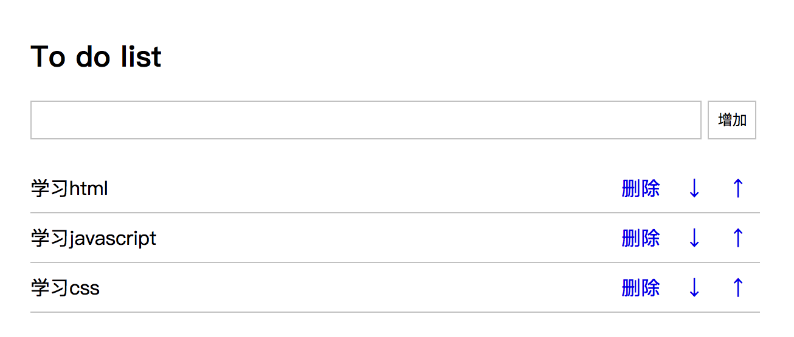
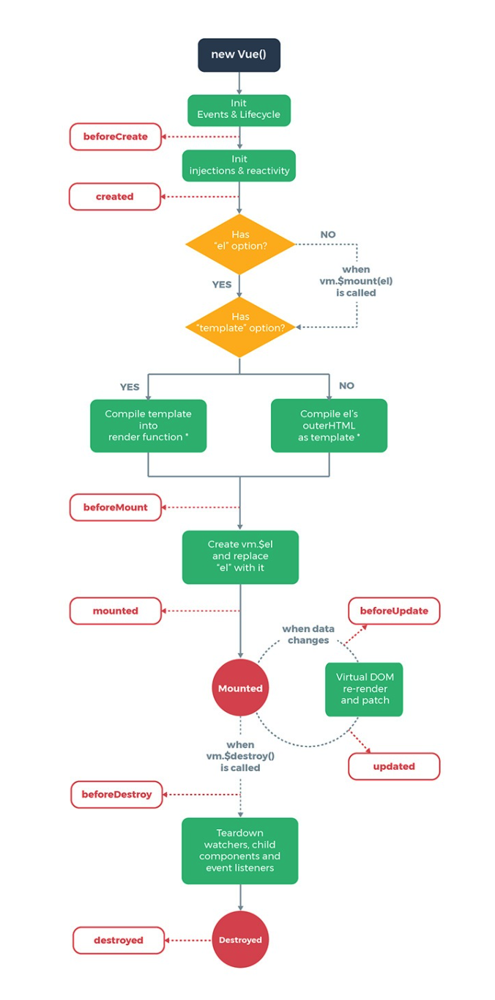

# **Vue.js入门**


## 1 vue的作者


尤雨溪是Vue.js框架的作者，他认为，未来App的趋势是轻量化和细化，能解决问题的应用就是好应用。而在移动互联网时代大的背景下，个人开发者的机遇在门槛低，成本低，跨设备和多平台四个方面。

## 2 Vue.js的概述
Vue.js读音 /vjuː/, 类似于 view

Vue.js是一个轻巧、高性能、可组件化的MVVM库，同时拥有非常容易上手的API

Vue.js是一个构建数据驱动的Web界面的库

Vue.js是一套构建用户界面的 渐进式框架

通俗的说:

+ Vue.js是一个构建数据驱动的 web 界面的渐进式框架

+ Vue.js 的目标是通过尽可能简单的 API 实现响应的数据绑定和组合的视图组件

+ 核心是一个响应的数据绑定系统

## 3 Vue.js使用文档及下载Vue.js

Vue.js使用文档已经写的很完备和详细了，通过以下地址可以查看： <https://cn.vuejs.org/v2/guide/>
vue.js如果当成一个库来使用，可以通过下面地址下载： <https://cn.vuejs.org/v2/guide/installation.html>


## 4. Vue的基本使用

+ Vue的基本使用步骤

#### 4.1 Vue的基本使用步骤

**第一步:导包**

官方提供了两个包

+ 开发包
  + vue.js

+ 生产包
  + vue.min.js

```js
<script src="./js/vue.js"></script>
```

#### 第二步:HTML


```html
<div class="box">{{content}}</div>
```

**第三步:使用VUE**

```js
window.onload = function () {
    var vm = new Vue({
        el:'.box',
        data: {
            content: 'Vue的基本使用'
        }
    });
}
```

示例

```html
<!DOCTYPE html>
<head>
    <meta charset="UTF-8">
    <title>Vue的基本使用</title>
    <!-- 01.导包 -->
    <script src="./js/vue.js"></script>
    <script>
        // 03. 监听
        window.onload = function () {
            // 04:创建vue
            var vm = new Vue({
                // 绑定操作对象
                el:'.box',
                data: {
                    content: 'Vue的基本使用'
                }
            });
        }
    </script>
</head>
<body>
    <!-- 02:div标签(设置模板变量)-->
    <div class="box">{{content}}</div>
    
</body>
</html>
```


## 5. Vue的基本语法

学习目标

+ 操作数据
+ 修改属性
+ 调用方法

#### 5.1 操作数据

示例

```html
<!DOCTYPE html>
<head>
    <meta charset="UTF-8">
    <title>操作数据</title>
    <script src="./js/vue.js"></script>
    <script>
        window.onload = function () {
            // uve对象
            var vm = new Vue({
                el:'.box',
                data:{
                    content:'操作数据'
                }
            });
        }
    </script>
</head>
<body>

    <div class="box">
        <p>{{content}}</p>
    </div> 
</body>
</html>
```

#### 5.2 修改属性

示例

```html
<!DOCTYPE html>
<head>
    <meta charset="UTF-8">
    <title>02-操作数据</title>
    <script src="./js/vue.js"></script>
    <script>
        window.onload = function () {
            // uve对象
            var vm = new Vue({
                el:'.box',
                data:{
                    content:'操作数据',
                    linkdata:'百度链接',
                    url:'http://www.baidu.com'
                }
            });
        }
    </script>
</head>
<body>
    <div class="box">
        <!-- 第一种. v-bind: -->
        <!-- <a v-bind:href="url" target="_blank">{{linkdata}}</a> -->
        <!-- 第二种. : -->
        <a :href="url" target="_blank">{{linkdata}}</a>
        <p>{{content}}</p>
    </div> 
</body>
</html>
```

#### 5.3 调用方法

示例

```html
<!DOCTYPE html>
<head>
    <meta charset="UTF-8">
    <title>操作数据</title>
    <script src="./js/vue.js"></script>
    <script>
        window.onload = function () {
            // uve对象
            var vm = new Vue({
                // 标签对象
                el:'.box',
                // 数据和属性
                data:{
                    content:'操作数据',
                    linkdata:'百度链接',
                    url:'http://www.baidu.com',
                    count:0
                },
                // 方法
                methods: {
                    fnAddClick:function () {
                        // 跨域
                       this.count += 1; 
                    }
                }

            });
        }
    </script>
</head>
<body>
    <div class="box">
        <!-- 第一种.v-on: -->
        <!-- <button v-on:click='fnAddClick'>计数器:{{count}}</button> -->
        <!-- 第二种.@ -->
        <button @click='fnAddClick'>计数器:{{count}}</button>
        <a v-bind:href="url" target="_blank">{{linkdata}}</a>
        <p>{{content}}</p>
    </div> 
</body>
</html>
```

>小结:
>
>v-bind:简写:
>
>v-on: 简写@


## 6. 条件渲染

学习目标

+ v-if
+ v-else-if
+ v-else
+ v-show

#### 6.1 条件渲染

通过条件指令可以控制元素的创建(显示)或者销毁(隐藏)

```html
<!DOCTYPE html>
<head>
    <meta charset="UTF-8">
    <title>条件渲染</title>
    <script src="./js/vue.js"></script>
    <script>
        window.onload = function () {
            var vm = new Vue({
                el:'.box',
                data:{
                    flag:4
                }
            });
        }
    </script>
</head>
<body>
    <div class="box">
        <!-- 01:v-if -->
        <!-- <p v-if='flag==1'>01:v-if</p> -->
        <!-- 02:v-else-if -->
        <!-- <p v-else-if='flag==2'>02:v-else-if</p> -->
        <!-- 03:v-else-if -->
        <!-- <p v-else-if='flag==3'>03:v-else-if</p> -->
        <!-- 04:v-else -->
        <!-- <p v-else>04:v-else</p> -->
        <!-- 05:v-show -->
        <!-- <p v-show='flag==3'>05:v-show</p> -->
    </div>
</body>
</html>
```

>小结:
>
>1. v-show用法和v-if大致一样，但是它不支持v-else,它和v-if的区别是，它制作元素样式的显示和隐藏，元素一直是存在的
>
>2. 注意在vue中使用v-show, 原来的css代码不能设置display属性, 会导致冲突

## 7. 列表渲染

学习目标

+ 普通列表
+ 列表下标
+ 有且只有一个对象
+ 对象列表

js部分

```js
<script>
    window.onload = function () {
    var vm = new Vue({
        el:'.box',
        data:{
            // 01: 普通列表
            itemList:[1, 2, 3, 4, 5],
            // 02: 列表下标
            indexList:['a','b','c','d'],
            // 03: 有且只有一个对象
            objData:{
                name:'小明',
                age:19
            },
            // 04: 对象列表
            objList:[
                {
                    name:'小明',
                    age:20
                },
                {
                    name:'小红',
                    age:21
                }
            ]
        }
    });
}
</script>  
```


#### 7.1 普通列表

```html
<li v-for='item in itemList'>{{item}}</li>
```

#### 7.2 列表下标

```html
<li v-for='(item,index) in indexList'>角标{{index}}==数值{{item}}</li>
```

#### 7.3 有且只有一个对象

```html
<li v-for='item in objData'>{{item}}</li>
<li v-for='(obj,key) in objData'>属性值{{obj}}-----属性名{{key}}</li>
```

#### 7.4 对象列表

```html
<li v-for='obj in objList'>属性值1:{{obj.name}}==属性值2:{{obj.age}}</li>
```

>小结:
>
>无非名字叫做列表渲染而已, 这种指令适合任何html标签

## 8. 表单输入绑定(双向绑定数据)

学习目标

+ 单行文本框
+ 多行文本框
+ 单选框
+ 多选框
+ 下拉框

可以用 v-model 指令在表单\ <input> 及 \<textarea> 元素上创建双向数据绑定。它会根据控件类型自动选取正确的方法来更新元素

```        
<!-- 01.单行文本框 -->
        <input type="text" v-model='content'>
        <p>{{content}}</p>

<!-- 02.多行文本框 -->
        <textarea v-model='content'></textarea>
        <p>{{content}}</p>
      
<!-- 03.单选框 -->
        <input type="radio" name="sex" value="男" v-model='content'>男
        <input type="radio" name="sex" value="女"  v-model='content'>女
        <p>{{content}}</p>
   
<!-- 04.多选框 -->
        <input type="checkbox" name="lk" value="吃饭" v-model='like'>吃饭
        <input type="checkbox" name="lk" value="睡觉" v-model='like'>睡觉
        <input type="checkbox" name="lk" value="打豆豆" v-model='like'>打豆豆
        <p>{{like}}</p>     
    
<!-- 05.下拉框 -->
        <select name="addr" v-model='address'>
            <option value="北京">北京</option>
            <option value="上海">上海</option>
            <option value="广州">广州</option>
            <option value="深圳">深圳</option>
        </select>
        <p>{{address}}</p>     
   
```

## 9. Todolist案例

学习目标

- Vue完成Todolist案例

## 10. ES6语法

学习目标

+ ES6的语法介绍
+ ES6的变量声明
+ ES6的对象的简写
+ ES6的箭头函数

#### 10.1 ES6语法介绍

ES6是JavaScript语言的新版本，它也可以叫做ES2015，之前学习的JavaScript属于ES5，ES6在它的基础上增加了一些语法，ES6是未来JavaScript的趋势，而且vue组件开发中会使用很多的ES6的语法，所以掌握这些常用的ES6语法是必须的。

#### 10.2 变量声明

let和const是新增的声明变量的开头的关键字，在这之前，变量声明是用var关键字，这两个关键字和var的区别是，它们声明的变量没有预解析，let和const的区别是，let声明的是一般变量，const申明的常量，不可修改

**var**

```js
console.log(iNum1);
// 在ES5中 声明变量使用var
var iNum1 = 10;
```

结果为:undefined, 因为使用 var 声明的变量, 有预解析

**let**

```js
console.log(iNum1);
// 在ES6中 声明变量可以使用let
let iNum1 = 10;
```

查看后会发现报错:iNum1 is not defined, 因为使用let 声明的变量, 没有了预解析

**const**

```js
const iNum1 = 10;
iNum1 = 20;
```

查看后会发现报错:Assignment to constant variable, 因为使用const声明的变量, 不允许重新赋值

#### 10.3 ES6的对象的简写

**ES5的写法**

```js
// ES5的对象写法
var oObj = {
    name:'小明',
    age:20,
    fnGetName: function () {
        alert(this.name);
    }
}
// 调用
oObj.fnGetName();
```

还可以写

```js
// 创建一个空对象
var oObj = {};
// 添加属性
oObj.name = '小明';
oObj.age = 20;
// 添加方法
oObj.fnGetName = function () {
    alert(this.name);
}
// 调用
oObj.fnGetName();
```

**ES6的写法**

需要注意的是, 实现简写,有一个前提,必须变量名属性名一致

```js
// 定义两个变量
var name = '小明';
var age = 20;
// 创建对象
var oObj = {
    name,
    age,
    fnGetName: function () {
        alert(this.name);
    }
};
// 调用
oObj.fnGetName();
```

#### 10.3 ES6的箭头函数

作用:

+ 定义函数新的方式
+ 改变this的指向

**定义函数新的方式**

```js
// 无参数无返回值
var fnTest = ()=> {
    alert('无参数无返回值');
}
// 一个参数无返回值
var fnTest = a => {
    alert(a + b);
}
// 有参数有返回值
var fnTest = (a,b)=> {
    return a + b;
}
```

**改变this的指向**

如果层级比较深的时候, this的指向就变成了window, 这时候就可以通过箭头函数解决这个指向的问题

```js
// 定义一个对象
var oObj = {
    name:'小明',
    fnAlert: function () {
        setTimeout(()=>{
            alert(this.name);
        }, 1000);
    }
}
// 调用方法
oObj.fnAlert();

```

## 11 实例生命周期(了解)

学习目标

+ 各个生命周期函数的作用


#### 各个生命周期函数的作用

+ beforeCreate
  + vm对象实例化之前
+ created
  + vm对象实例化之后
+ beforeMount
  + vm将作用标签之前
+ mounted
  + vm将作用标签之后
+ beforeUpdate
  + 数据或者属性更新之前
+ updated
  + 数据或者属性更新之后


